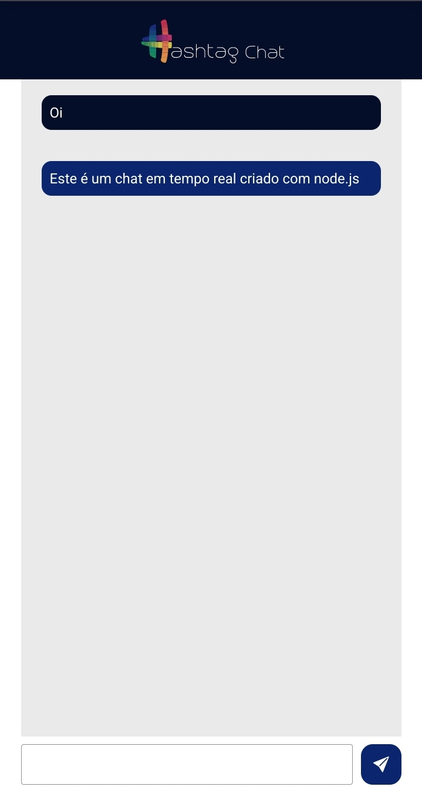

## 📞 Chat em Tempo Real
Projeto de chat em tempo real do último dia do Intensivão de JavaScript da [Hashtag Treinamentos](https://youtube.com/@HashtagProgramacao?si=-M1aRzBpNVh4okNX). Neste projeto conheci o socket.io e o Express, que é um framework para node js, bem como trabalhar com o protocolo HTTP.



***
## 🖥 Linguagens usadas
 


***
## ⚒️💻 Ferramentas e Frameworks
[](https://socket.io/)
[](https://socket.io/)

## Para Testar
- Clone este repositório na sua máquina com o cimando: 
```
git clone https://github.com/Iarley-01/chat-tempo-real.git
```
- Depois instale o Express com o comando:
```
npm install express
```
- Depois instale o socket.io com o comando:
```
npm install socket.io
```
- Por fim execute o comando no terminal: 
```
node --watch ./servidor.js
```
e abra o navegador e digite ```localhost:3000```